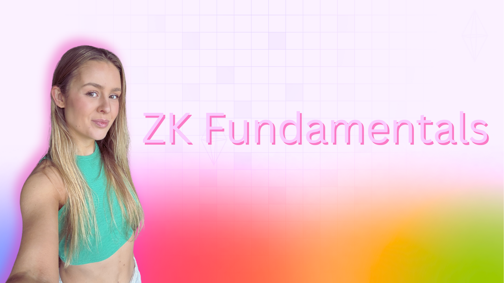

> ⚠️ **Important:** If you're looking for the [foundry-full-course](https://github.com/Cyfrin/foundry-full-course-cu) or [moccasin-full-course](https://github.com/Cyfrin/moccasin-full-course-cu) you can find them here:
> 
> [Foundry/Solidity: https://github.com/Cyfrin/foundry-full-course-cu](https://github.com/Cyfrin/foundry-full-course-cu)
> 
> [Moccasin/Vyper: https://github.com/Cyfrin/moccasin-full-course-cu](https://github.com/Cyfrin/moccasin-full-course-cu)

[contributors-shield]: https://img.shields.io/github/contributors/cyfrin/fundamentals-of-zero-knowledge-proofs-cu.svg?style=for-the-badge
[contributors-url]: https://github.com/cyfrin/fundamentals-of-zero-knowledge-proofs-cu/graphs/contributors
[forks-shield]: https://img.shields.io/github/forks/cyfrin/fundamentals-of-zero-knowledge-proofs-cu.svg?style=for-the-badge
[forks-url]: https://github.com/cyfrin/fundamentals-of-zero-knowledge-proofs-cu/network/members
[stars-shield]: https://img.shields.io/github/stars/cyfrin/fundamentals-of-zero-knowledge-proofs-cu.svg?style=for-the-badge
[stars-url]: https://github.com/cyfrin/fundamentals-of-zero-knowledge-proofs-cu/stargazers
[issues-shield]: https://img.shields.io/github/issues/cyfrin/fundamentals-of-zero-knowledge-proofs-cu.svg?style=for-the-badge
[issues-url]: https://github.com/cyfrin/fundamentals-of-zero-knowledge-proofs-cu/issues
[license-shield]: https://img.shields.io/github/license/cyfrin/fundamentals-of-zero-knowledge-proofs-cu.svg?style=for-the-badge
[license-url]: https://github.com/cyfrin/fundamentals-of-zero-knowledge-proofs-cu/blob/master/LICENSE.txt
[linkedin-shield]: https://img.shields.io/badge/-LinkedIn-black.svg?style=for-the-badge&logo=linkedin&colorB=555

<h1> Zero-Knowledge Fundamentals </h1>

<strong>Learn zero-knowledge proof fundamentals, and level up your career
</strong>

[![Stargazers][stars-shield]][stars-url] [![Forks][forks-shield]][forks-url]
[![Contributors][contributors-shield]][contributors-url]
[![Issues][issues-shield]][issues-url]
[![MIT License][license-shield]][license-url]

     
    

     

Welcome to the repository for the Zero-Knowledge Fundamentals Course. This course is a high-level introduction to zero-knowledge proofs (ZKPs): what they are and why they are really cool! 

This course will help you go from having no idea what ZKPs to being able to understand what they are conceptually. It is intended as a preliminary resource for both devs and non-devs prior to learning any math or practical coding.

This repository houses course resources and [discussions](https://github.com/Cyfrin/fundamentals-of-zero-knowledge-proofs-cu/discussions) for the course.

Please refer to this for an in-depth explanation of the content:

- [Website](https://updraft.cyfrin.io) - Join Cyfrin Updraft and enjoy 50+ hours of smart contract development courses
- [Twitter](https://twitter.com/CyfrinUpdraft) - Stay updated with the latest course releases
- [LinkedIn](https://www.linkedin.com/school/cyfrin-updraft/) - Add Updraft to your learning experiences
- [Discord](https://discord.gg/cyfrin) - Join a community of 3000+ developers and auditors
- [Newsletter](https://cyfrin.io/newsletter) - Weekly security research tips and resources to level up your career
- [Codehawks](https://codehawks.com) - Smart contracts auditing competitions to help secure web3
<!-- *Lol, my t-shirt is backwards in 2 of them* -->
<!-- *Add the YT link when posted* -->

 

 

Cyfrin Updraft Courses:

- [Cyfrin Updraft - Zero Knowledge Fundamentals](https://updraft.cyfrin.io/courses/fundamentals-of-zero-knowledge-proofs)

[YouTube Link]()

# Prerequisites

- [Blockchain Basics](https://updraft.cyfrin.io/courses/blockchain-basics)
  - Understanding of blockchain systems
  - Basic understanding of hashing

# Resources For This Course

- Watch on [Cyfrin Updraft](https://updraft.cyfrin.io)
- AI
  - [ChatGPT](https://chat.openai.com/)
    - Just know that it will often get things wrong, but it's very fast!
  - [Phind](https://www.phind.com/)
    - Like ChatGPT, but it searches the web
  - [Bard](https://bard.google.com/)
  - [Other AI extensions](https://twitter.com/aisolopreneur/status/1654823630155464704?s=42&t=-pu_sCYtfrfPJU7OXfifrQ)
- [Github Discussions](https://github.com/Cyfrin/foundry-full-course-cu/discussions)
  - Ask questions and chat about the course here!
- [Cryptography Stack Exchange](https://crypto.stackexchange.com/)
  - Great place for asking technical questions about ZKPs!

# Zero-Knowledge Fundamentals Section 1: What is a Zero-Knowledge Proof?

## Introduction

_[⌨️ Introduction](https://updraft.cyfrin.io/courses/fundamentals-of-zero-knowledge-proofs/fundamentals/course-navigation)_

## Meet the instructor

_[⌨️ Meet the instructor?](https://updraft.cyfrin.io/courses/fundamentals-of-zero-knowledge-proofs/fundamentals/meet-the-instructor)_

## Course navigation

_[⌨️ Course navigation](https://updraft.cyfrin.io/courses/fundamentals-of-zero-knowledge-proofs/fundamentals/course-navigation)_

## What is a zero-knowledge proof?

_[⌨️ What is a Zero-Knowledge Proof?](https://updraft.cyfrin.io/courses/fundamentals-of-zero-knowledge-proofs/fundamentals/zkp-overview)_

- [Ethereum article on ZK Proofs](https://ethereum.org/en/zero-knowledge-proofs/)
- [Helpful zero-knowledge proofs blog post](https://www.cyfrin.io/blog/what-is-a-zero-knowledge-proof-a-practical-guide-for-programmers)
- [Another helpful video by CoinGecko](https://www.youtube.com/watch?v=e_Im2g2xsAg)
- [Porter Adam's video on ZKPs](https://www.youtube.com/watch?v=-2qHqfqPeR8)
- Big thanks to [Jarrod Watts](https://x.com/jarrodWattsDev) for [his video on zero-knowledge proofs](https://www.youtube.com/watch?v=_MYpZQVZdiM) as this was my first taste!

## Interactive vs non-interactive zero-Knowledge proofs

_[⌨️ Interactive vs non-interactive ZKPs](https://updraft.cyfrin.io/courses/fundamentals-of-zero-knowledge-proofs/fundamentals/interactive-vs-non-interactive)_

- [The Ali Baba cave](https://pages.cs.wisc.edu/~mkowalcz/628.pdf)
- [The ZK Podcast](https://open.spotify.com/episode/6GT105Xm2rJzntZjTrSRwC?si=TjYOcAs-TwmNQGtdjODusw) also has some awesome examples (including the wheere's Waldo example where I first heard it).
- [Jarrod Watts](https://x.com/jarrodWattsDev) explains some examples in [his video on zero-knowledge proofs](https://www.youtube.com/watch?v=_MYpZQVZdiM)!

## ZK terminology

_[⌨️ ZK terminology](https://updraft.cyfrin.io/courses/fundamentals-of-zero-knowledge-proofs/fundamentals/zk-terminology)_

Helpful resource that helped research for this video:
- [Article by Santiago Palladino A beginner's intro to coding zero-knowledge proofs](https://dev.to/spalladino/a-beginners-intro-to-coding-zero-knowledge-proofs-c56)
- [This QAPs article by Vitalik Buterin explains the witness well in context](https://medium.com/@VitalikButerin/quadratic-arithmetic-programs-from-zero-to-hero-f6d558cea649)

## The trusted setup

_[⌨️ The trusted setup](https://updraft.cyfrin.io/courses/fundamentals-of-zero-knowledge-proofs/fundamentals/trusted-setup)_

- Big thanks to Vitalik Buterin for [his blog post on the trusted setup](https://vitalik.eth.limo/general/2022/03/14/trustedsetup.html#:~:text=Many%20cryptographic%20protocols%2C%20especially%20in,some%20cryptographic%20protocol%20is%20run.). This video was researched using this awesome article.

## Proof of computation

_[⌨️ Proof of computation](https://updraft.cyfrin.io/courses/fundamentals-of-zero-knowledge-proofs/fundamentals/proof-of-computation)_

Quote from the [Noir](https://noir-lang.org/) website that makes things clearer:

-  "Noir is a language for private and verifiable computing. It enables creating succinct proofs of successful program execution. "

- [Vitalik's article on SNARKs for proof of computation](https://vitalik.eth.limo/general/2021/01/26/snarks.html)

## ZKP requirements

_[⌨️ ZKP requirements](https://updraft.cyfrin.io/courses/fundamentals-of-zero-knowledge-proofs/fundamentals/ZKP-requirements)_

- Shout out to [RKM](https://x.com/rkm0959) from [Succinct Labs](https://www.succinct.xyz/) for the awesome lessons that helped in the development of this course but particularly this lesson.

## ZK in practice

_[⌨️ ZK in practice](https://updraft.cyfrin.io/courses/fundamentals-of-zero-knowledge-proofs/fundamentals/zk-in-practice)_

- ZK circuit writing languages mentioned:
  - [Noir](https://noir-lang.org/)
  - [Circom](https://docs.circom.io/)

Helpful resource on ZKPs for developers:
- [A beginners into the coding ZKPS](https://dev.to/spalladino/a-beginners-intro-to-coding-zero-knowledge-proofs-c56)

Again, S/O to [RKM](https://x.com/rkm0959) from [Succinct Labs](https://www.succinct.xyz/) who introduced me to the concept of the "backend" and "frontend" in the context of ZKPs.

## Example ZK projects

_[⌨️ Example ZK projects](https://updraft.cyfrin.io/courses/fundamentals-of-zero-knowledge-proofs/fundamentals/examples-zk-projects)_

## Summary

_[⌨️ Summary](https://updraft.cyfrin.io/courses/fundamentals-of-zero-knowledge-proofs/fundamentals/summary)_

# Disclosures

Transparency is important! So we want to disclose any potential conflicts that might have affected my judgement so you can pick tools that are right for you. Patrick is co-founder of Alpha Chain, a blockchain infrastructure company. Alpha Chain runs **Chainlink, Ethereum, Binance, Polygon, Harmony, Solana, Moonbeam, and Moonriver blockchain services.** Alpha Chain often works with Alchemy and receives discounted services. Patrick is the co-founder of Cyfrin, and they do smart contract security & auditing services. Patrick is also the co-founder of Chain Accel, who is an advisor on the Peeranha project.

Because of all this, I have added alternatives to each section where we suggest a tool.

(<a href="#table-of-contents">back to top</a>) ⬆️

# Thank you

Thanks to everyone who is taking, participating in, and working on this course. It's been a passion project and a data dump of everything I've learnt in the web3 space to get you up to speed quickly. Also, a big thank you to Cyfrin & Chain Accel for encouraging this course to come to light, and many, many, many people from the community.

**A special thanks to:**
- [RKM](https://x.com/rkm0959) from [Succinct Labs](https://www.succinct.xyz/) for the awesome lessons and learning resources provided to the Cyfrin team.
- [Jarrod Watts'](https://x.com/jarrodWattsDev) [video on ZK proofs](https://www.youtube.com/watch?v=_MYpZQVZdiM) as this video was very helpful development of this course.
- [RareSkills blog](https://www.rareskills.io/blog)
- Vitalik Buterin's article series on ZK proofs.
- [Porter Adam's](https://x.com/portport255?lang=en) from [ZKsync](https://www.zksync.io/) for his suppoort in my research and his [AWESOME ZK live stream series](https://www.youtube.com/watch?v=-2qHqfqPeR8&t=2566s)
- [ZK Moon Math Manual](https://github.com/LeastAuthority/moonmath-manual)

And thanks to the [Cyfrin](https://www.cyfrin.io/) team for making this possible!

## License

Cyfrin Updraft content is open-sourced [licensed as GPLv3](https://github.com/cyfrin/foundry-full-course-cu/blob/main/LICENSE).

